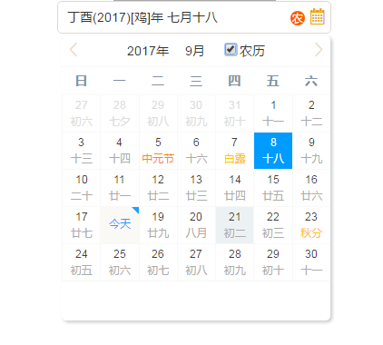

# vue-jLunar-datePicker
@JinWen

> Lunar-Date-Picker component, lightWeight, powerful, easy to use, with festival and solar terms.





### Getting Start

---


**New for 2.0**

1、add a new Property : 
  type : DATE/DATERANGE (you can pick a period of time by use  DATERANGE option)
  
2、fixed bugs  

**Install**

`npm install vue-jlunar-datepicker --save`

**Usage**

main.js

```vue
import Vue from 'vue';

import JDatePicker from 'vue-jlunar-datepicker';

Vue.component("j-date-picker",JDatePicker);

```

test.vue

```vue
<template>
    <j-date-picker v-model="value1"
         :width="width1"
         :placeholder="placeholder"
         :picker-options="pickerOptions"
         :rangeSeparator="rangeSeparator"
         @change="onDateChange"
         :disabled="disabled"
         :showLunarClass="showLunarClass"
         :showLunarControl="showLunarControl"
         :type="type"
         :showBackYears="showBackYears"
         :showLunarIcon="showLunarIcon"
         :format="format">
    </j-date-picker>
</template>
<script>
export default{
  data(){
    return{
      data:{
        value1:'',
        type:'DATE',
        showLunarClass:'MIX',
        showBackYears:2,
        showLunarIcon:true,
        showLunarControl:true,
        width1:'300',
        format:'YYYY.MM.DD',
        placeholder:'please input something ...',
        rangeSeparator:'-',
        disabled:false,
        editable:true,
        clearable:true,
        pickerOptions: {
          disabledDate (time) {
            return time.getTime() < Date.now() - 8.64e7;
          }
      }
    }
  }
}
</script>
```


### API

---

**Attributes**

| Properties      | Description                      | Type      |  Optional value       | Default value         |
| :---------------- | :--------------------------------------- | :------      | :------------ | :------------ |
| value             | bind-value(v-model)                      | String,Date,Array  | --          | --           |
| width             | width                                      | String      | --            | 200px/200         |
| type              |you can pick a day or pick a period of time | String     | DATE/DATERANGE      | DATE         |
| showLunarClass    | The display type of a lunar date; case insensitive;      | String  | FULLLUNAR/LUNAR/NUMBER/MIX|  NUMBER|
| showLunarIcon       | whether to show lunar icon           | Boolean       | true/false     | false        |
| showBackYears   | the years number after now  based on the current year | Number     | --            | 2            |
| format           | format Date | String       | --            | YYYY-MM-DD   |
| showLunarControl    | whether to show the lunar control by default  | Boolean   | true/false      | true         |
| editable    | whether to input your date int the component  | Boolean   | true/false      | false         |
| placeholder    | placeholder for component             | String        | --                  | --         |
| clearable    | whether to show the clear button  | Boolean   | true/false      | true         |
| disabled    | whether to disable this component | Boolean   | true/false      | false         |
| rangeSeparator    | date separator                        | String        | --        | '-'         |
| picker-options    | refer to the following                        | object        | --        | {}         |

**picker-options**

| Properties      | Description                      | Type      |  Optional value       | Default value         |
| :---------------- | :--------------------------------------- | :------      | :------------ | :------------ |
| disabledDate    | Set disable date.Parameter is current date.you should return Boolean .Like examples!  | Function        | --        | --         |


**event**

| event name      | Description                      | return      | 
| :---------------- | :--------------------------------------- | :------      | 
| change    | When the input value changes return the value  | value        | 


**GitHub**
https://github.com/tuhe32/vue-jLunar-datePicker

For detailed explanation on how things work, checkout the [guide](http://vuejs-templates.github.io/webpack/) and [docs for vue-loader](http://vuejs.github.io/vue-loader).
